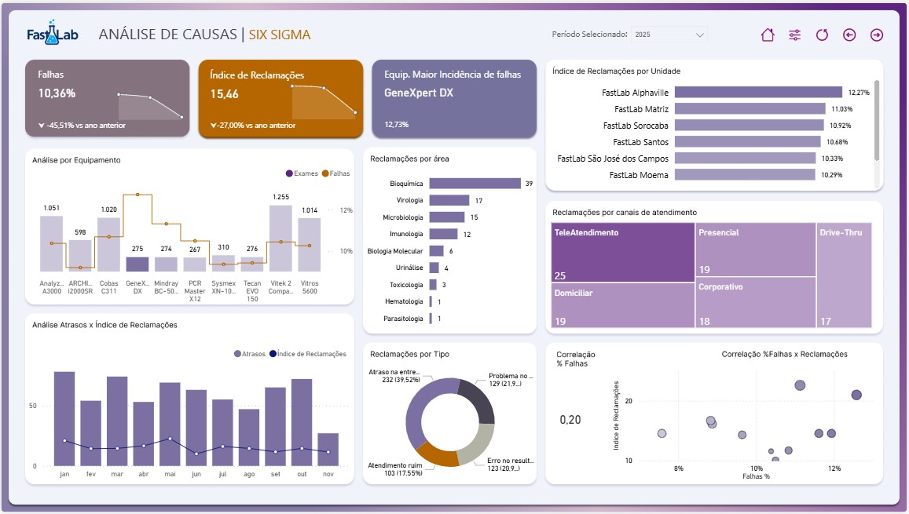

# Sigma FastLab  Dashboard Power BI

Este repositório documenta o painel Sigma FastLab, focado em monitorar o desempenho operacional de coleta, exames e atendimento. Ele oferece uma visão executiva com KPIs, tendências e análises por unidade, rota e equipes.

- Visualização online (Power BI): https://app.powerbi.com/view?r=eyJrIjoiNTNjNmIzNjMtMDgxYy00YTk5LWFjYjktZWQ5M2Y3Njk3NjIwIiwidCI6IjA5ZjRiZmNhLTY3Y2QtNGU0Zi05NjNkLWExYzk1MzEyNmMwNCJ9
- Licença: MIT (ver arquivo LICENSE)

## Capa


## Páginas do dashboard

### Página 1


### Página 2



## Destaques

- KPIs de produção e atendimento: volume de exames, tempo médio, SLA e qualidade.
- Operações e logística: desempenho por unidade, rotas e equipes de coleta/entrega.
- Experiência do cliente: indicadores de reclamações e níveis de satisfação.
- Tendências e comparativos: análise mês a mês e por categorias (exame, setor, turno).

## Abrir localmente

Este repositório contém imagens e documentação. O projeto PBIP (Power BI Project) está disponível localmente no ambiente de desenvolvimento.

Caso possua o projeto local:
1. Abra o Power BI Desktop (versão atual).
2. No menu Arquivo > Abrir, selecione o projeto `SigmaLab.pbip` no diretório do projeto.
3. Atualize as conexões conforme necessário e publique se desejar.

## Estrutura do repositório

```
Sigma-FastLab/
 assets/
    screenshots/
        capa.jpg
        pg01.jpg
        pg02.jpg
 README.md
 LICENSE
```

## Licença

Este projeto está licenciado sob a MIT License  você pode usar, copiar, modificar e distribuir livremente, mantendo os avisos de copyright. Veja o arquivo `LICENSE` para mais detalhes.

## Contato

Em caso de dúvidas ou sugestões, sinta-se à vontade para abrir uma issue ou entrar em contato.
